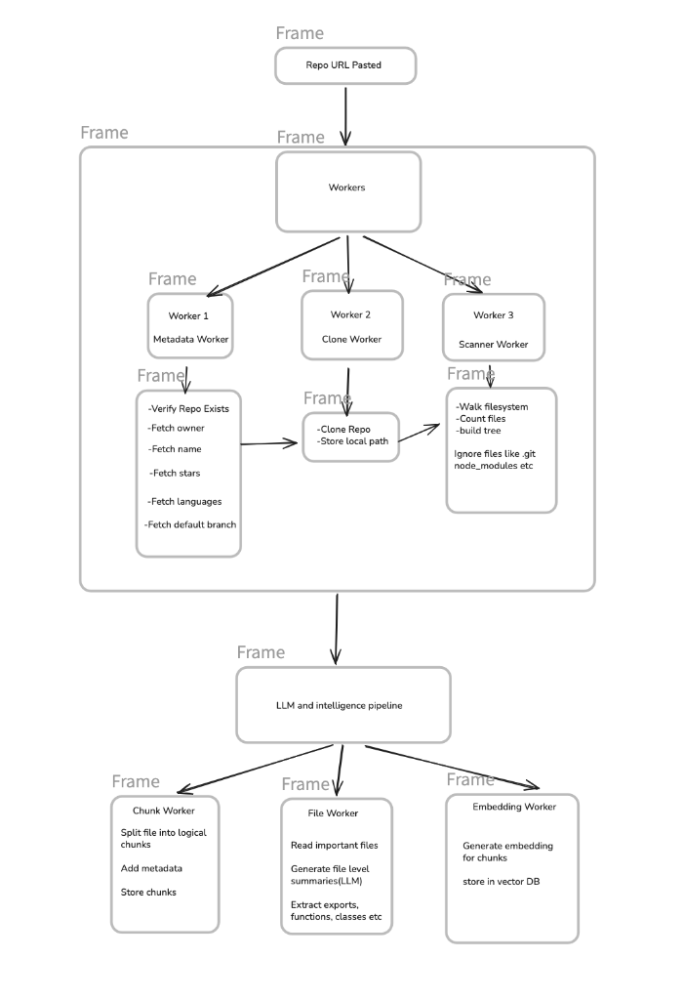
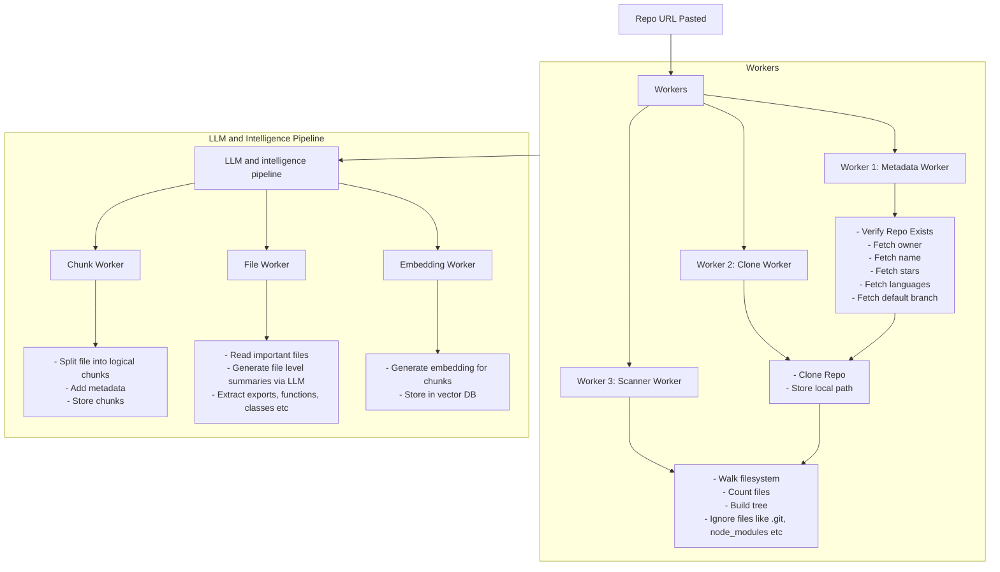

To install dependencies:
```sh
bun install
```

To run:
```sh
bun run dev
```

open http://localhost:3000

## System Workflow





### Process Description

1. **Repo URL Pasted**: The workflow begins when a user submits a GitHub repository URL.
2. **Workers Pipeline**:
    - **Metadata Worker (Worker 1)**: Verifies that the repository exists, and fetches metadata including owner, repository name, stars count, programming languages, and the default branch.
    - **Clone Worker (Worker 2)**: Once metadata is verified, it clones the repository to the local system and saves the path.
    - **Scanner Worker (Worker 3)**: Walks the repository filesystem to build the directory tree, count files, and filter out ignored directories/files such as `.git` and `node_modules`.
3. **LLM and Intelligence Pipeline**:
    - **Chunk Worker**: Splits repository files into logical text chunks, attaches metadata to each chunk, and stores them.
    - **File Worker**: Reads key files, uses LLMs to generate file-level summaries, and extracts codebase elements like exports, functions, and classes.
    - **Embedding Worker**: Computes vector embeddings for the chunks and saves them in the vector database.
